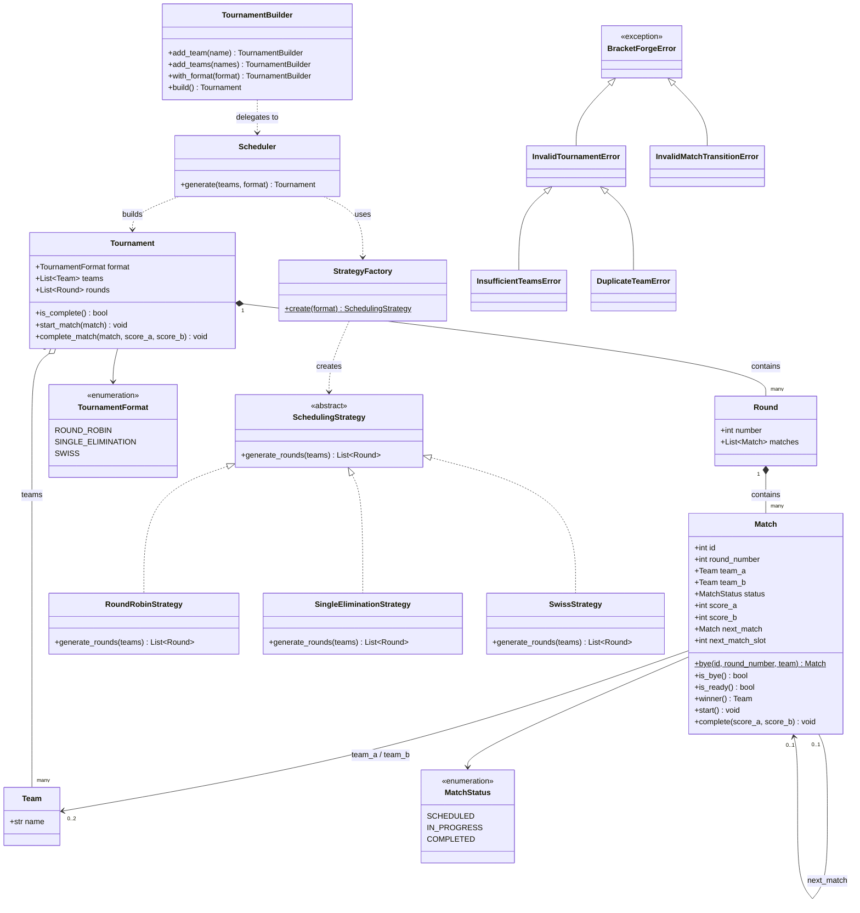
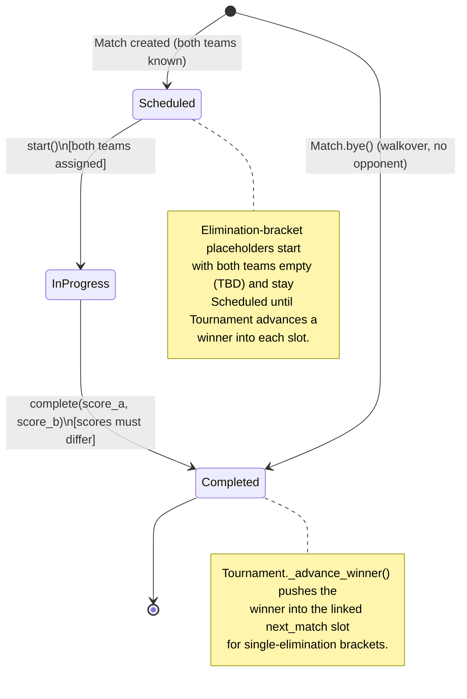
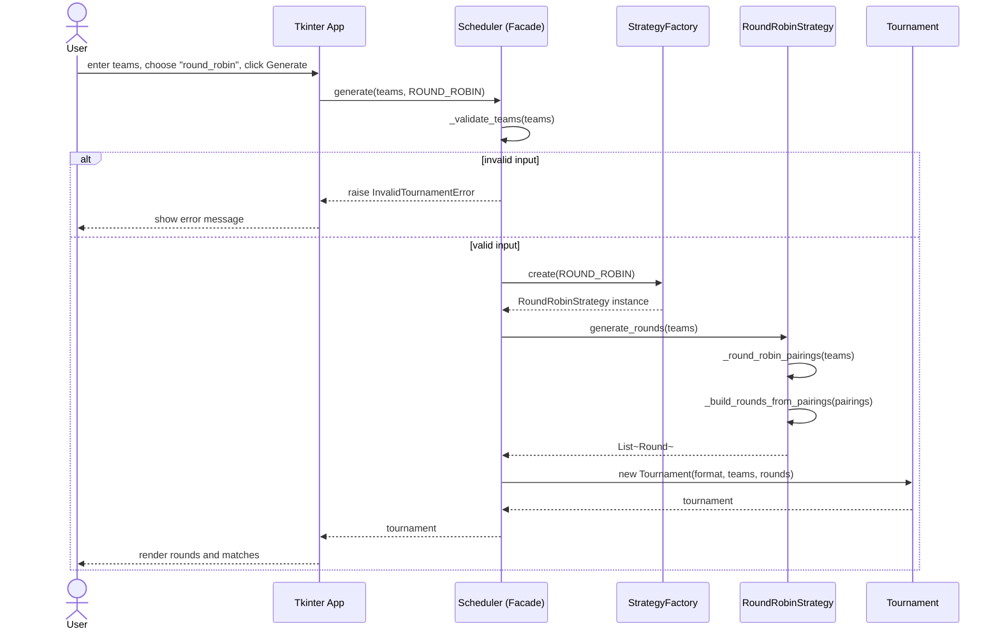
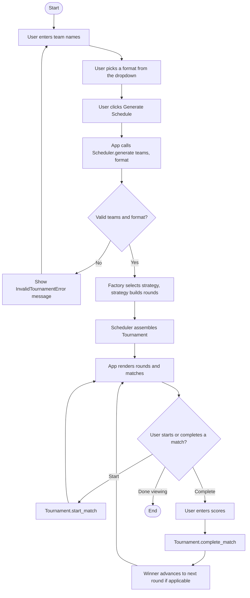

# BracketForge — Design Document

## 1. High-level architecture

The repo is split into two packages that don't depend on each other equally:

```
bracketforge/   the library — all fixture-generation logic, zero GUI dependencies
app/            the desktop client — Tkinter only, zero scheduling logic
```

The dependency only goes one way: `app` imports `bracketforge`, and nothing
in `bracketforge` imports from `app`. That's not just a convention — grep
the library's source and there's no reference to `app` anywhere in it. As
proof, `examples/use_library.py` runs the whole library with `app/` not even
part of the import graph.

```
+------------------+        imports        +----------------------+
|     app/         |  --------------------> |     bracketforge/     |
|  Tkinter GUI      |                        |  domain model +        |
|  (main.py, views) |                        |  strategies + facade    |
+------------------+                        +----------------------+
```

Everything a client needs — `Scheduler`, `TournamentBuilder`, the domain
classes, `TournamentFormat`, the exceptions — gets re-exported from
`bracketforge/__init__.py`, so nobody outside the library needs to reach into
`strategies.py` or `factory.py` directly.

### 1.1 Class diagram



## 2. Low-level architecture

### 2.1 Domain model (`bracketforge/models.py`)

`Team` is about as simple as it gets — an immutable dataclass identified by
name.

`Match` is where most of the interesting behavior lives. It has a small
state machine: `SCHEDULED -> IN_PROGRESS -> COMPLETED`, enforced by `start()`
and `complete()`. Try to skip a step or repeat one — starting twice,
completing before starting, completing twice, ending in a tie — and you get
an `InvalidMatchTransitionError`. Once a match starts, the score resets to
0-0 so it can be nudged live with `adjust_score("a"/"b", delta)`; `complete()`
still accepts explicit final scores for callers that already have them.
Byes are handled through `Match.bye()`, a classmethod that returns a match
that's already `COMPLETED` — so a walkover never touches the `start()` path
at all.



`Round` is just an ordered list of matches. `Tournament` sits above all of
it as the aggregate root — it's what `Scheduler.generate()` actually hands
back, and it owns `start_match()`, `adjust_score()`, and `complete_match()`.
`complete_match()` falls back to whatever the live score currently is if no
explicit score is passed in, then checks whether the match feeds into
another one (`Match.next_match`) and pushes the winner into that slot if so.
That's a deliberate split: `Match` only ever needs to know its own two teams
and its own state, while `Tournament` is the one thing that understands how
the whole bracket fits together.

### 2.2 Strategy pattern (`bracketforge/strategies.py`)

`SchedulingStrategy` is an abstract base with one method —
`generate_rounds(teams) -> list[Round]`. Three strategies implement it:

- **RoundRobinStrategy** uses the classic circle method: every team plays
  every other team exactly once, with a bye worked in each round if the team
  count is odd.
- **SingleEliminationStrategy** pads the field up to the next power of two
  and hands out byes to the top seeds using the standard tournament seed
  order (1, 8, 4, 5, 2, 7, 3, 6, ...) so two byes never end up facing each
  other. Each match gets linked to whichever placeholder match it feeds into
  via `next_match`/`next_match_slot`. Everything after round one starts out
  as empty TBD placeholders that fill in as earlier matches wrap up.
- **SwissStrategy** is intentionally *not* adaptive — see the note below on
  why. It generates all `ceil(log2(n))` rounds upfront using the same
  circle-method pairing as round robin, which at least guarantees nobody
  plays the same opponent twice.

`RoundRobinStrategy` and `SwissStrategy` actually share their match-building
step through a helper function, `_build_rounds_from_pairings` — the only
real difference between the two is how many rounds of pairings get
generated.

### 2.3 Factory pattern (`bracketforge/factory.py`)

`StrategyFactory.create(format_)` is a one-line lookup from the format enum
to a strategy instance. It's the only spot in the codebase that knows the
format-to-strategy mapping, so adding a new format later just means adding
an enum value, a strategy class, and one dictionary entry — nothing else
needs to change.

### 2.4 Facade + Builder (`bracketforge/scheduler.py`)

`Scheduler` is the facade — `generate(teams, format_) -> Tournament` is
really the only call most clients need. It checks the input (team count,
duplicate names) before it even asks the factory for a strategy, so callers
never have to deal with `StrategyFactory` or the strategy classes unless
they specifically want to.

`TournamentBuilder` sits on top of `Scheduler` as a fluent wrapper for
callers that are starting from raw strings — `add_team("Falcons")` — instead
of already-built `Team` objects. That's the case the Tkinter app is in,
since it's just pulling names out of text entries.



### 2.5 Exceptions (`bracketforge/exceptions.py`)

There are two small exception hierarchies here, kept separate on purpose.
`InvalidTournamentError` (with `InsufficientTeamsError` and
`DuplicateTeamError` under it) covers bad *input* — something wrong with
what you asked for. `InvalidMatchTransitionError` covers illegal *state*
changes — asking a match to do something it can't do from where it
currently is. A caller that only cares about "was my input okay" can catch
the first one; a caller driving match state through its lifecycle can catch
the second separately. Both trace back to `BracketForgeError`.

### 2.6 The app (`app/`)

`app/main.py` sets up the Tkinter window: an entry field plus a listbox for
teams, a combobox for the format, and a scrollable area for results. The
only thing it calls into the library is `Scheduler().generate(...)` — it
doesn't touch anything else. `app/views.py` is what actually draws the
`Tournament` that comes back: one `LabelFrame` per round, one row per match.
A scheduled match gets a Start button; an in-progress one gets a live
scoreboard (wired to `Tournament.adjust_score()`) with a 60-second countdown
running off `Tk.after()`. Once that clock hits zero the score locks and
Finish (`complete_match()`) is all that's left. Neither of these two files
ever computes a pairing, a seed, or a bracket slot — that logic exists in
exactly one place, `bracketforge/strategies.py`.



## 3. Design patterns — where and why

**Strategy** (`SchedulingStrategy` and its three implementations) exists
because each format's pairing algorithm is genuinely different from the
others. Wrapping them behind a common interface lets `Scheduler` treat all
three the same way, and means a new format can be dropped in later without
touching any of the existing ones.

**Factory** (`StrategyFactory.create()`) keeps the format-to-class mapping
in a single place instead of it being copy-pasted as `if/elif` chains
wherever a strategy needs to get picked.

**Facade** (`Scheduler.generate()`) gives whoever's calling the library one
method and one return type, hiding validation, strategy selection, and
building the `Tournament` behind it.

**Builder** (`TournamentBuilder`) exists for the case where input arrives
incrementally as plain strings rather than as ready-made `Team` objects —
which is exactly what happens when someone's typing team names into a GUI
one at a time.

## 4. A few design decisions worth explaining

**Why byes are `team_b = None` instead of a fake "BYE" team.** A sentinel
team would show up in `tournament.teams` and anything else iterating over
real participants, so it'd have to get filtered out everywhere. Using `None`
plus the `is_bye` property keeps "there's no opponent here" both explicit
and easy to check, without a fake object floating around the system.

**Why `is_bye` checks for `status == COMPLETED` and not just "one side is
None".** This one's a bit subtle. A round-2 placeholder that's already
received a team through bye propagation, but is still waiting on its other
feeder match, also has exactly one side set to `None` — but it isn't a bye,
it's just not fully paired up yet. Without the status check, that placeholder
would look identical to an actual walkover. Tying `is_bye` to "completed
without ever being played" (which is only true for matches built through
`Match.bye()`) keeps the two cases from getting confused.

**Why Swiss doesn't actually re-pair each round based on standings.** A real
Swiss tournament pairs each round using results from the round before it —
which obviously can't be computed before any matches have been played. Since
`Scheduler.generate()` is a single call that hands back the entire schedule
at once, there's no natural place for that kind of round-by-round feedback
loop to live without turning the whole library into something stateful and
multi-call. So instead, Swiss here just seeds pairings across
`ceil(log2(n))` rounds up front, guaranteeing no repeated opponents. It's a
simplification, made on purpose, not something that got missed.

**Why the 60-second clock only locks the score buttons and not
`complete_match()` itself.** If the whole match locked at 0:00, a match that
happened to be tied right when the clock ran out would be stuck — draws
aren't allowed, so there'd be no way to actually finish it. Locking just the
+/- buttons and leaving Finish active means it can still call
`complete_match()`, which re-enables the buttons on a tie so the organizer
can break it and then actually finish the match.

**Why winner propagation lives on `Tournament` and not on `Match`.** A
`Match` shouldn't need to know it's part of a bracket — it only needs to
track its own two teams and its own state. `Tournament.complete_match()`
calls `match.complete()` and then, only if that match has a `next_match` set,
pushes the winner into the right slot. That keeps `Match` reusable across
all three formats (round robin and Swiss never set `next_match` at all)
instead of baking bracket-specific behavior into the state machine itself.
